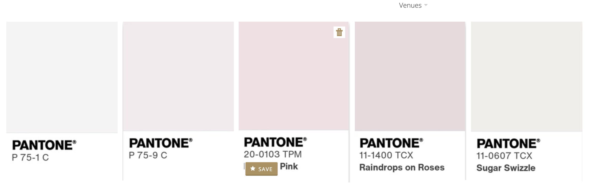

# Wedding color palette

Liane and Peyton's wedding palette: five soft whites and blush pinks, specified as Pantone colors.

| # | Pantone | Name | Approx. hex |
| - | ------- | ---- | ----------- |
| 1 | P 75-1 C | — | `#F5F4F4` |
| 2 | P 75-9 C | — | `#F1EBED` |
| 3 | 20-0103 TPM | _"… Pink"_ (partly hidden in the source screenshot) | `#EFE0E3` |
| 4 | 11-1400 TCX | Raindrops on Roses | `#E6DADC` |
| 5 | 11-0607 TCX | Sugar Swizzle | `#F0EEEB` |

## About the hex values

The Pantone codes are the source of truth. The hex values were sampled from the swatches in
`color-palette.png`, a screenshot of a venue-planning site, so they are only approximations of
the printed colors. Prefer official Pantone conversions when they're available.

## Usage

This palette isn't wired into any app's `--site-*` tokens yet. Each app sets its own tokens in
`src/app/globals.css`. Adopting the palette there changes how the site looks, so it goes through
the Superpowers design workflow in `AGENTS.md`.

Every color here is very light, so none of them gives readable contrast for body text on
another. Use them for backgrounds, surfaces, and borders, and pair them with a darker foreground
and accent.
